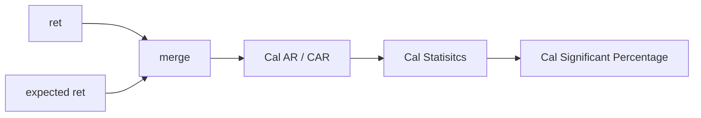

# Event Study 


## 1. Ret (df)
- Common key ```股號``` ```日期```
- 個股的日報酬率 : ```r```
## 2. Expected ret (df)
- Common key ```股號``` ```日期```
- 個股的期望報酬```E(r)```
- $E(r) = CAPM$，可根據情況切換計算公式
## 3. Merge
- merge 1. and 2 based on Common key ```股號``` ```日期```
## 4. Cal AR / CAR

### 4.1 Cal AR
AR = $r-E(r)$

### 4.2 Determine widnow

- CAR = 